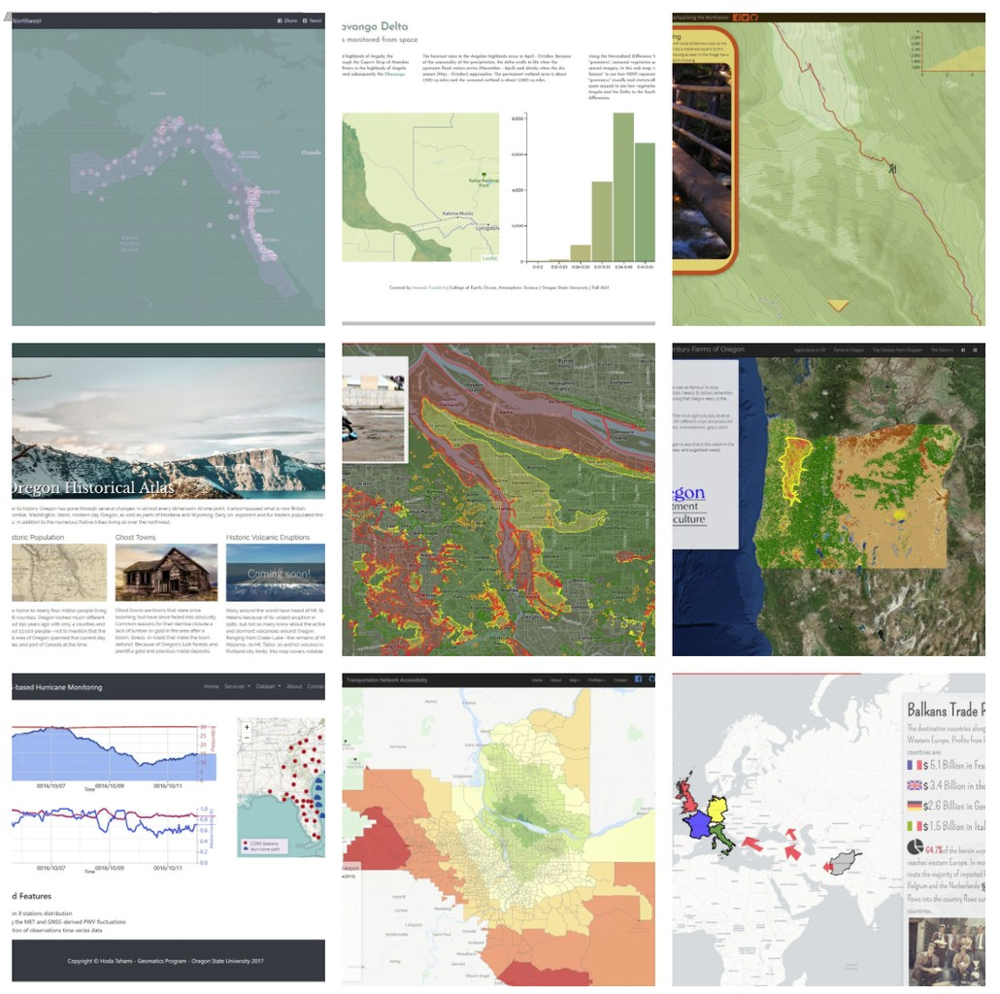
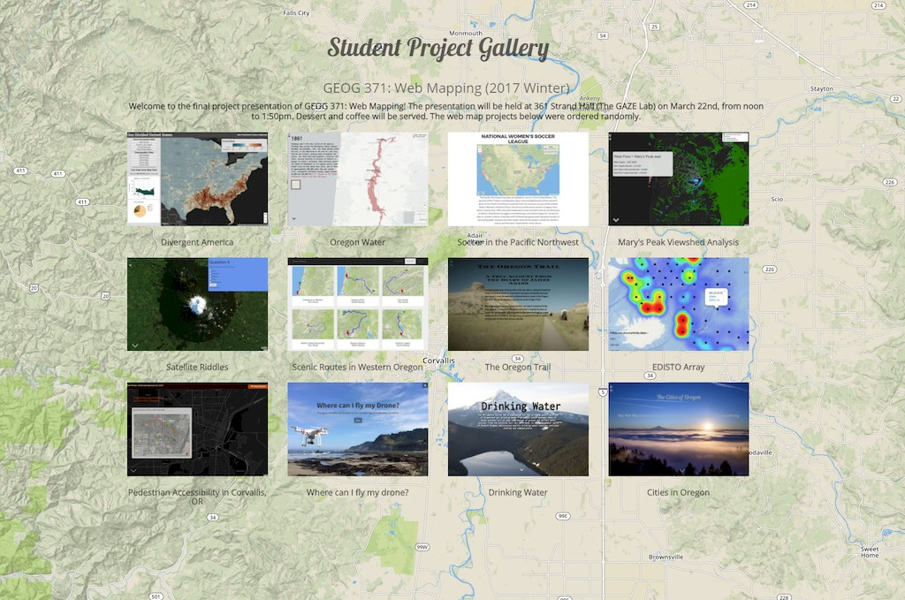
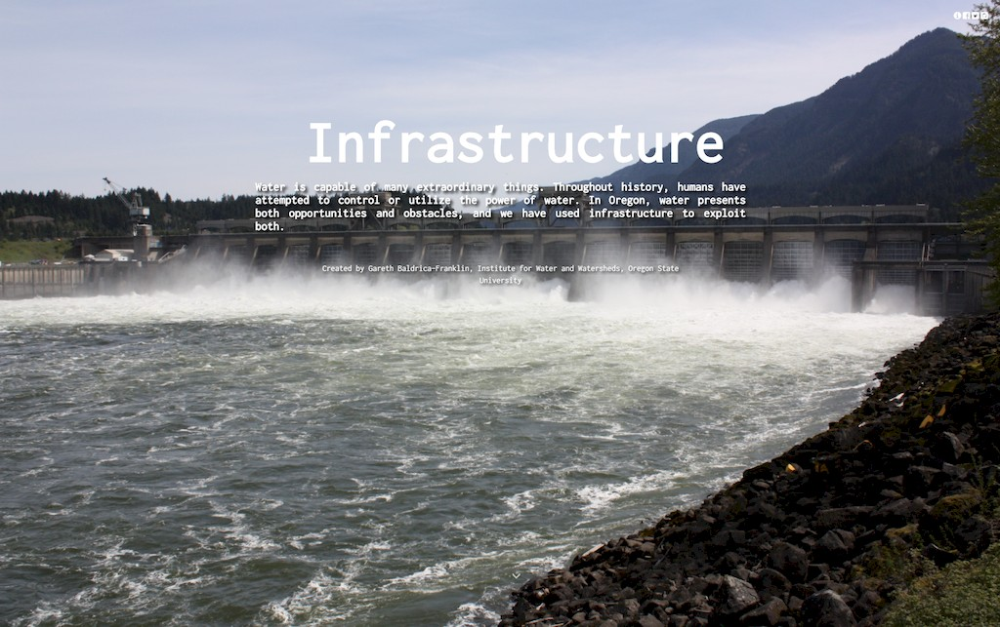

# GEOG571: Advanced Web Mapping

>**Instructor:** Bo Zhao, zhao2@oregonstate.edu | **Office Hours:** M 1600 - 1900 or by appt. @WLKN 210
>
>**Lecture:** MWF 0900 - 0950 @WLKN 210 | **Lab:** T 1200 to 1350 @WLKN 210
>
>**Catalog course description: WEB MAPPING (4).**
>
>Concepts and techniques of web programming, digital storytelling, online project management, and web-based cartographic principles for eveloping, evaluating, and using web maps. Lec/lab.

Welcome to GEOG571:Web Mapping :earth_americas:! This course introduces concepts and techniques of web programming, digital storytelling, online project management, and web-based cartographic principles for developing, evaluating, and using web maps. To promote the equal access to web mapping technology, we ensure all the web mapping applications from course materials can be opened, debugged or further developed in either Windows or Mac OSX operating systems, and all the relevant software or services are either open source or free. This course is comprised of two major components, including lectures and lab exercises. The lectures focus on the theories and principles behind web mapping, including system architecture, responsive user graphic design, map design and geo-narrative. The lab exercises focus on practical skills for web programming, 2d and 3d web mapping, web mapping services, and digital storytelling. In addition, there will be random quizzes focusing on prior lecture materials, a mid-term focusing on basic concepts and web programming techniques. Although there is no final exam, but each student is expected to design a web map and deploy it to an openly accessible server (e.g., GitHub). From this course, students can learn both the principles of web-based cartography and the practical skills for web mapping, and develop the capabilities of map aesthetics and critique. **The course schedule might be slightly changed due to the rate of progress, the latest schedule will be on the github repository frontpage.** If you have any question about this course, feel free to contact [Dr. Bo Zhao](mail://zhao2@oregonstate.edu) for more information. :raising_hand:

> [Gear up the Working Environment ](resources/gearup.md) :computer: :cloud: :earth_americas: :beer:

| Week  |               Lecture (M)                |               Lecture (W)                |                 Lab (M)                |               Lecture (F)                |                 Reading                  |
| :---: | :--------------------------------------: | :--------------------------------------: | :--------------------------------------: | :--------------------------------------: | :--------------------------------------: |
| Wk 01 |    [Intro to the Course](lectures/lec01), [Gear Up! :gear:](resources/gearup.md)    |   [Internet Fundamentals](lectures/lec00)   | [Lab 1: Project Management for Web Mapping](labs/lab01)  |  [Intro to Web Mapping](lectures/lec02)  | [Markdown, Links and Command Lines](readings/wk01.md) |
| Wk 02 | [Web Programming Basics I: HTML 5 and CSS](lectures/lec03) | [System Architecture for Web Mapping](lectures/lec04) | [Lab 2: Web Programming Basics II: Javascript](labs/lab02) | [Web Programming Basics III: JQuery](lectures/lec05) | [HTML, CSS and Javascript](readings/wk02.md) |
| Wk 03 | *MLK Day* |  [Web Programming Basics IV: Debugging](lectures/lec05)  |          [Lab 3: Web Map Design](labs/lab03/readme.md)           |[Spatial Data for Web Mapping](lectures/lec06)  |  [Leaflet and GeoJson](readings/wk03.md)  |
| Wk 04 |  [Map Client I: Basics and Geographic Features](lectures/lec07) | [Map Client II: Map Events and Mashup](lectures/lec08)  |              Lab 3: Cont'd               |  [Map Client III: Web Map Interaction](lectures/lec09) |    [GeoServer Documentation](readings/wk04.md)    |
| Wk 05 |  [Map Server I: Intro to GeoServer](lectures/lec10)   | [Map Server II: Styling](lectures/lec11)    |          [Lab 4: Web Map Services and Basemap](labs/lab04/)  |  [Map Server III: Web Map Services](lectures/lec12)  | [Bing Map Tile, WFS and WMS](readings/wk05.md) |
| Wk 06 |       [Map Server IV: Base Map Design using Mapbox](lectures/lec13)                   |   [Map Server V: Map Tiles](lectures/lec14)    |              Lab 4: Cont'd               |   Midterm Exam  | [Bootstrap Documentation](readings/wk06.md) |
| Wk 07 | [Map Design I: Web Template and Framework](lectures/lec15)  | [Map Design II: Bootstrap](lectures/lec16)  |             [Lab 5: Story Map](labs/lab05/readme.md)             | [Storytelling with Web Map I](lectures/lec17)   |   [Web Map Design Principles](readings/wk07.md)    |
| Wk 08 |    Storytelling with Web Map II, cont'd with the last lecture      |  [Map Design III: User Friendly Design Principles](lectures/lec19)            |              Lab 5: Cont'd               |      [3D Web Mapping I: Basics](lectures/lec23),         |         [Cesium Documentation](readings/wk08.md)                         |
| Wk 09 |               [3D Web Mapping II: Thematic Map on a Virtual Globe](lectures/lec25)  [HeatMap](lectures/lec21)   | [Map Design IV: Map Critiques](lectures/lec22) | [Lab 6:  Thematic Map on a Virtual Globe](labs/lab06) |  [Real-Time Mapping: TweetMap](lectures/lec20)  |                [Server-Side JavaScript](readings/wk09.md)                                     |
| Wk 10 |  [Emerging Topics on Web Mapping](lectures/lec26)    | Final Project Discussion and Preparation   |              Final Project Discussion and Preparation             |       Final Project Presentation - *Strand Ag Hall (GAZE) TBD*       |       [Elwood et al. (2012), Sui and Zhao (2015)](readings/wk10.md)                                   |

[**Syllabus**](resources/geog571-syllabus.pdf)

### Course Project :star:
-  [Final Project Guidelines](project/readme.md)
 - [Guideline](project/readme.md) (WK02)
 - [Proposal]() (WK03)
 - [Data Source](project/datasource.md) (WK04)
 - [Interface Sketch](project/sketch.md) (WK05)
 - [Map Critique](lectures/lec22) (WK08)
 - [Peer Review]() (WK10)
 - [Final Presentation]() (WK10)

### Tutorials

- [Favicon](lectures/lec16/readme.md)
- [Videos](resources/video.md)
- [Images](resources/image.md)
- [Iconagrpahy](resources/icon.md)
- [Web Fonts](resources/fonts.md)
- [Colors](resources/color.md)
- [Social media](lectures/lec16/readme.md)

### Programming Languages

[Html](), [CSS](), [Javascript](), and [Markdown]()

### Desktop Software

[Chrome](https://www.google.com/chrome/browser/desktop/index.html), [Atom](https://atom.io/), [QGIS](http://www.qgis.org/en/site/), and [GeoServer](http://geoserver.org/)

### Web Services

[GitHub](https://github.com/), [jsfiddle](https://jsfiddle.net/), [Mapbox](https://www.mapbox.com/), [W3Schools](https://www.w3schools.com/), and [geojson.io](http://geojson.io)
​
### Libraries for Web Mapping

[Jquery](https://jquery.com/), [Bootstrap](http://getbootstrap.com/), [Leaflet](https://leafletjs.com), [Storymap.js](https://github.com/jakobzhao/storymap), and [Cesium](cesiumjs.org)

### Previous Years

#### [2017 Fall](http://geoviz.ceoas.oregonstate.edu/geog571.html#portfolio)

#### [2017 Winter](http://geoviz.ceoas.oregonstate.edu/project_gallery/)

- :trophy: [A story map on Infrastructure for Water Management](http://rawgit.com/cartobaldrica/water_atlas/master/infrastructure_index.html) from a former student has won the environmental challenge 2017

### Credits
This course material is maintained by the [Cartography and Geovisualization Group at Oregon State University](http://geoviz.ceoas.oregonstate.edu). Some of the material in this course are based on the classes taught at MIT and Penn State University and I have heavily drawn on materials and examples found online and tried our best to give credit by linking to the original source. Please contact us if you find materials where the credit is missing or that you would rather have removed.
